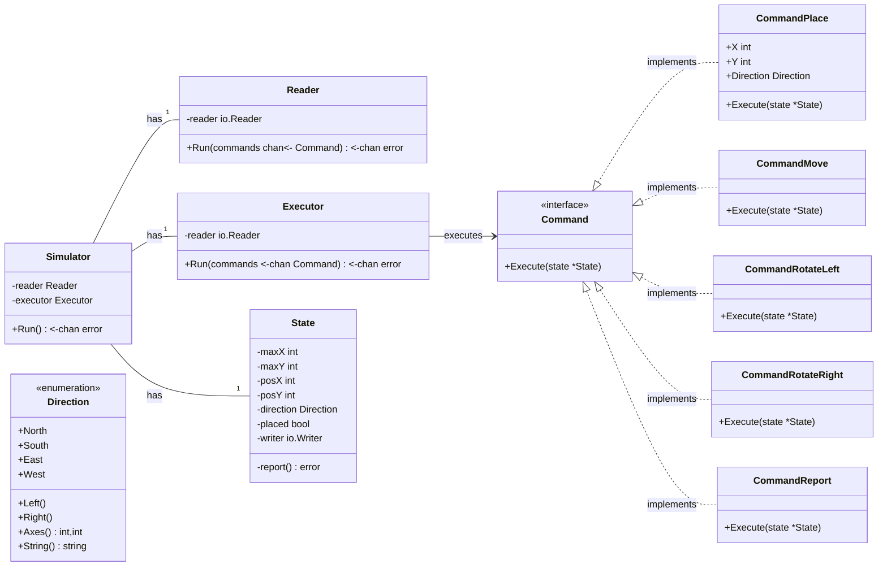

# 🤖 Toy Robot

Toy robot [coding challenge](CHALLENGE.md) solution written in Go.

## 🧰 Dependencies

- [Go 1.20](https://go.dev/dl/)

## 🚀 Run Simulation

1. Start the toy robot simulator
   <br><br>
  
   Go:

    ```shell
    go run cmd/main/main.go
    ```
   Docker:

     ```shell
     docker build -t local/toyrobot .
     docker run --interactive --rm --name toyrobot local/toyrobot
     ```

2. Enter commands e.g.

    ````
    PLACE 0,0,NORTH
    MOVE
    REPORT
    ````

3. Stop the toy robot simulator with `ctrl+D`

## 🔬 Run Tests

```shell
go test ./... -cover
```

## 📝 Domain Model


